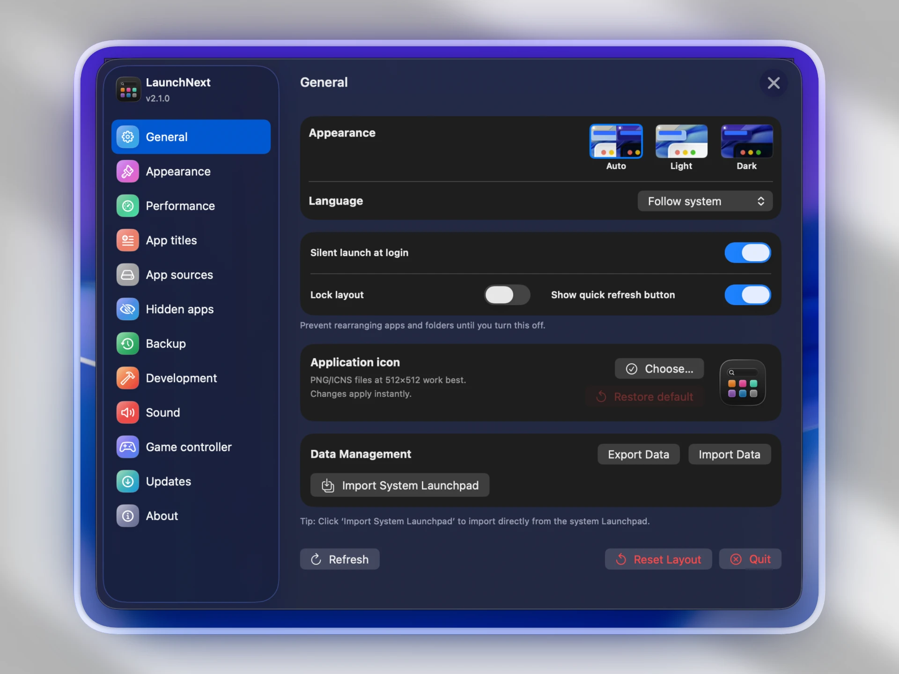
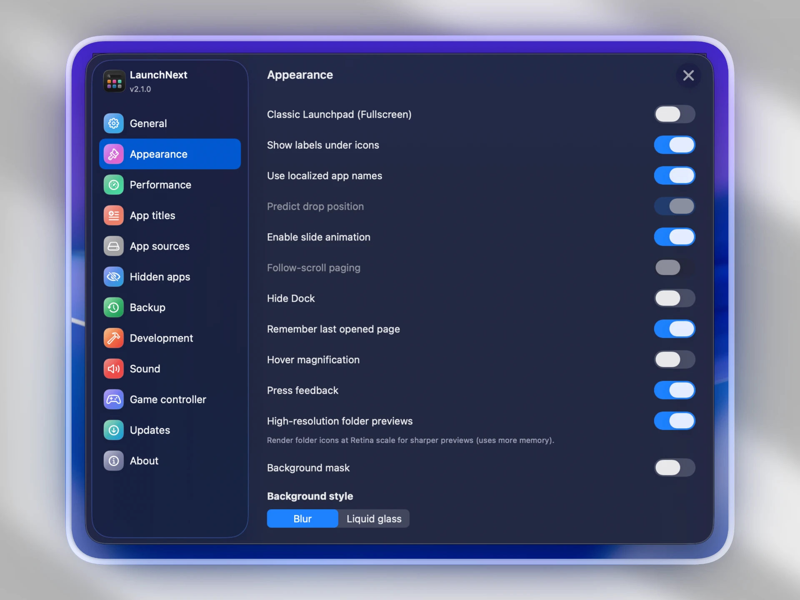

# LaunchNext

**Langues**: [English](../README.md) | [中文](README.zh.md) | [日本語](README.ja.md) | [한국어](README.ko.md) | [Français](README.fr.md) | [Español](README.es.md) | [Deutsch](README.de.md) | [Русский](README.ru.md) | [हिन्दр](README.hi.md) | [Tiếng Việt](README.vi.md) | [Italiano](README.it.md) | [Čeština](README.cs.md)

## 📥 Télécharger

**[Télécharger ici](https://github.com/RoversX/LaunchNext/releases/latest)** - Obtenez la dernière version

⭐ Pensez à donner une étoile à [LaunchNext](https://github.com/RoversX/LaunchNext) et surtout au projet original [LaunchNow](https://github.com/ggkevinnnn/LaunchNow) !

| | |
|:---:|:---:|
|  |  |
|  |  |

macOS Tahoe a supprimé le Launchpad, et la nouvelle interface est difficile à utiliser, elle n'utilise pas pleinement votre Bio GPU. Apple, donnez au moins aux utilisateurs une option pour revenir en arrière. En attendant, voici LaunchNext.

*Construit sur [LaunchNow](https://github.com/ggkevinnnn/LaunchNow) par ggkevinnnn — un immense merci au projet original !❤️*

*LaunchNow a choisi la licence GPL 3. LaunchNext suit les mêmes termes de licence.*

⚠️ **Si macOS bloque l'application, exécutez ceci dans le Terminal :**
```bash
sudo xattr -r -d com.apple.quarantine /Applications/LaunchNext.app
```
**Pourquoi** : Je ne peux pas me permettre le certificat développeur d'Apple (99$/an), donc macOS bloque les applications non signées. Cette commande supprime le flag de quarantaine pour permettre l'exécution. **Utilisez cette commande uniquement pour les applications de confiance.**

### Ce que LaunchNext offre
- ✅ **Import en un clic depuis l'ancien Launchpad système** - lit directement votre base de données SQLite Launchpad native (`/private$(getconf DARWIN_USER_DIR)com.apple.dock.launchpad/db/db`) pour recréer parfaitement vos dossiers, positions d'applications et mise en page existants
- ✅ **Expérience Launchpad classique** - fonctionne exactement comme l'interface originale bien-aimée
- ✅ **Support multi-langues** - internationalisation complète avec anglais, chinois, japonais, français et espagnol
- ✅ **Masquer les étiquettes d'icônes** - vue propre et minimaliste quand vous n'avez pas besoin des noms d'applications
- ✅ **Tailles d'icônes personnalisées** - ajustez les dimensions des icônes selon vos préférences
- ✅ **Gestion intelligente des dossiers** - créez et organisez des dossiers comme avant
- ✅ **Recherche instantanée et navigation clavier** - trouvez les applications rapidement

### Ce que nous avons perdu dans macOS Tahoe
- ❌ Pas d'organisation personnalisée des applications
- ❌ Pas de dossiers créés par l'utilisateur
- ❌ Pas de personnalisation par glisser-déposer
- ❌ Pas de gestion visuelle des applications
- ❌ Regroupement catégoriel forcé

## Fonctionnalités

### 🎯 **Lancement d'applications instantané**
- Double-clic pour lancer directement les applications
- Support complet de la navigation au clavier
- Recherche ultra-rapide avec filtrage en temps réel

### 📁 **Système de dossiers avancé**
- Créer des dossiers en glissant les applications ensemble
- Renommer les dossiers avec édition en ligne
- Icônes de dossiers personnalisées et organisation
- Glisser-déposer d'applications de manière transparente

### 🔍 **Recherche intelligente**
- Correspondance floue en temps réel
- Rechercher dans toutes les applications installées
- Raccourcis clavier pour accès rapide

### 🎨 **Design d'interface moderne**
- **Effet verre liquide**: regularMaterial avec ombres élégantes
- Modes d'affichage plein écran et fenêtré
- Animations et transitions fluides
- Mise en page propre et réactive

### 🔄 **Migration de données transparente**
- **Import Launchpad en un clic** depuis la base de données macOS native
- Découverte et scan automatique des applications
- Stockage persistant de la mise en page via SwiftData
- Zéro perte de données lors des mises à jour système

### ⚙️ **Intégration système**
- Application macOS native
- Positionnement multi-écrans intelligent
- Fonctionne avec le Dock et autres applications système
- Détection des clics d'arrière-plan (fermeture intelligente)

## Architecture technique

### Construit avec des technologies modernes
- **SwiftUI**: Framework UI déclaratif et performant
- **SwiftData**: Couche de persistance de données robuste
- **AppKit**: Intégration système macOS profonde
- **SQLite3**: Lecture directe de base de données Launchpad

### Stockage des données
Les données de l'application sont stockées en sécurité dans :
```
~/Library/Application Support/LaunchNext/Data.store
```

### Intégration Launchpad native
Lit directement depuis la base de données système Launchpad :
```bash
/private$(getconf DARWIN_USER_DIR)com.apple.dock.launchpad/db/db
```

## Installation

### Configuration requise
- macOS 15 (Sequoia) ou version ultérieure
- Processeur Apple Silicon ou Intel
- Xcode 26 (pour compiler depuis les sources)

### Compiler depuis les sources

1. **Cloner le référentiel**
   ```bash
   git clone https://github.com/yourusername/LaunchNext.git
   cd LaunchNext/LaunchNext
   ```

2. **Compiler le metteur à jour**
   ```bash
   swift build --package-path UpdaterScripts/SwiftUpdater --configuration release --arch arm64 --arch x86_64 --product SwiftUpdater
   ```

3. **Ouvrir dans Xcode**
   ```bash
   open LaunchNext.xcodeproj
   ```

4. **Compiler et exécuter**
   - Sélectionner votre périphérique cible
   - Appuyer sur `⌘+R` pour compiler et exécuter
   - Ou `⌘+B` pour compiler seulement

### Compilation en ligne de commande
```bash
xcodebuild -project LaunchNext.xcodeproj -scheme LaunchNext -configuration Release
```

## Utilisation

### Premiers pas
1. **Premier lancement**: LaunchNext scanne automatiquement toutes les applications installées
2. **Sélectionner**: Cliquer pour sélectionner les applications, double-clic pour lancer
3. **Rechercher**: Taper pour filtrer instantanément les applications
4. **Organiser**: Glisser les applications pour créer des dossiers et des mises en page personnalisées

### Importer votre Launchpad
1. Ouvrir les paramètres (icône d'engrenage)
2. Cliquer sur **"Import Launchpad"**
3. Votre mise en page et vos dossiers existants seront automatiquement importés

### Gestion des dossiers
- **Créer un dossier**: Glisser une application sur une autre
- **Renommer un dossier**: Cliquer sur le nom du dossier
- **Ajouter des applications**: Glisser les applications dans les dossiers
- **Supprimer des applications**: Glisser les applications hors des dossiers

### Modes d'affichage
- **Fenêtré**: Fenêtre flottante avec coins arrondis
- **Plein écran**: Mode plein écran pour une visibilité maximale
- Changer de mode dans les paramètres

## Problèmes connus

> **Statut de développement actuel**
> - 🔄 **Comportement de défilement**: Peut être instable dans certains scénarios, surtout avec des gestes rapides
> - 🎯 **Création de dossiers**: La détection de collision pour créer des dossiers par glisser-déposer est parfois incohérente
> - 🛠️ **Développement actif**: Ces problèmes sont activement traités dans les prochaines versions

## Dépannage

### Problèmes courants

**Q: L'application ne démarre pas ?**
R: Assurez-vous d'avoir macOS 15+ et vérifiez les permissions système.

**Q: Le bouton d'import est manquant ?**
R: Vérifiez que SettingsView.swift inclut la fonctionnalité d'import.

**Q: La recherche ne fonctionne pas ?**
R: Essayez de re-scanner les applications ou de réinitialiser les données d'application dans les paramètres.

**Q: Problèmes de performance ?**
R: Vérifiez les paramètres de cache d'icônes et redémarrez l'application.

## Pourquoi choisir LaunchNext ?

### Vs l'interface "Applications" d'Apple
| Fonctionnalité | Applications (Tahoe) | LaunchNext |
|---------|---------------------|------------|
| Organisation personnalisée | ❌ | ✅ |
| Dossiers utilisateur | ❌ | ✅ |
| Glisser-déposer | ❌ | ✅ |
| Gestion visuelle | ❌ | ✅ |
| Import données existantes | ❌ | ✅ |
| Performance | Lent | Rapide |

### Vs autres alternatives Launchpad
- **Intégration native**: Lecture directe de base de données Launchpad
- **Architecture moderne**: Construit avec SwiftUI/SwiftData les plus récents
- **Zéro dépendance**: Swift pur, aucune bibliothèque externe
- **Développement actif**: Mises à jour et améliorations régulières
- **Design verre liquide**: Effets visuels premium

## Contribution

Nous accueillons les contributions ! Veuillez :

1. Forker le référentiel
2. Créer une branche de fonctionnalité (`git checkout -b feature/amazing-feature`)
3. Commiter les changements (`git commit -m 'Add amazing feature'`)
4. Pousser vers la branche (`git push origin feature/amazing-feature`)
5. Ouvrir une Pull Request

### Directives de développement
- Suivre les conventions de style Swift
- Ajouter des commentaires significatifs pour la logique complexe
- Tester sur plusieurs versions de macOS
- Maintenir la compatibilité arrière

## L'avenir de la gestion d'applications

Alors qu'Apple s'éloigne des interfaces personnalisables, LaunchNext représente l'engagement de la communauté envers le contrôle utilisateur et la personnalisation. Nous croyons que les utilisateurs devraient décider comment organiser leur espace de travail numérique.

**LaunchNext** n'est pas seulement un remplacement de Launchpad - c'est une déclaration que le choix de l'utilisateur compte.


---

**LaunchNext** - Reprenez le contrôle de votre lanceur d'applications 🚀

*Construit pour les utilisateurs macOS qui refusent de compromettre sur la personnalisation.*

## Outils de développement

Ce projet a été développé avec l'aide de :
- Claude Code - Assistant de développement alimenté par IA
- Cursor
- OpenAI Codex Cli - Génération et optimisation de code