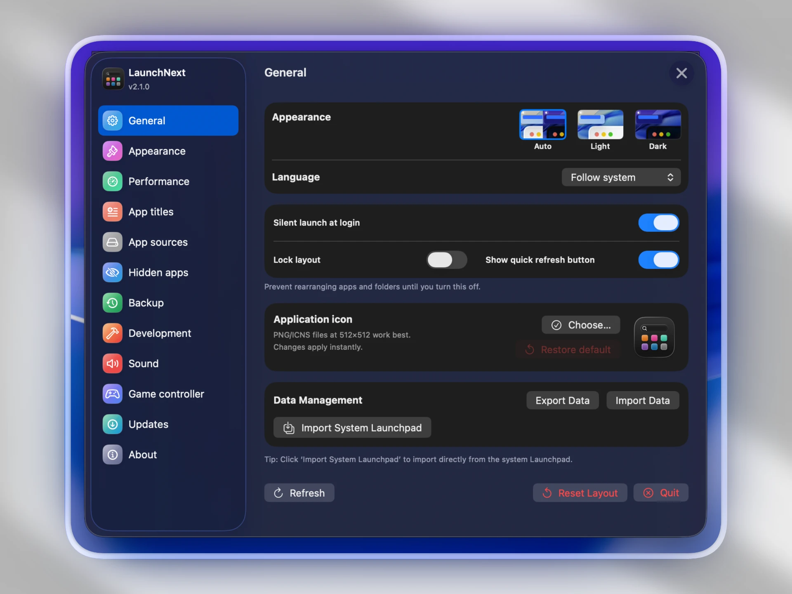
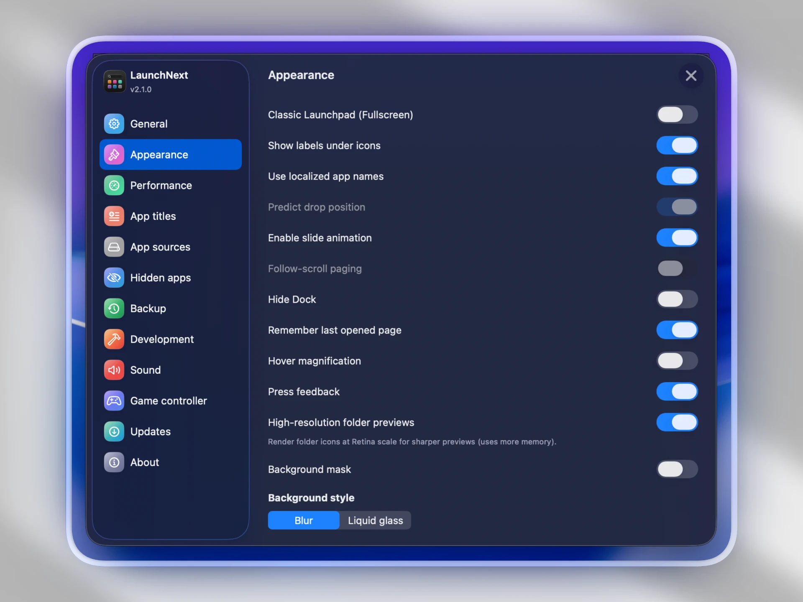

# LaunchNext

**언어**: [English](../README.md) | [中文](README.zh.md) | [日本語](README.ja.md) | [한국어](README.ko.md) | [Français](README.fr.md) | [Español](README.es.md) | [Deutsch](README.de.md) | [Русский](README.ru.md) | [हिन्दी](README.hi.md) | [Tiếng Việt](README.vi.md) | [Italiano](README.it.md) | [Čeština](README.cs.md)

## 📥 다운로드

**[눌러서 다운받기](https://github.com/RoversX/LaunchNext/releases/latest)** - 여기서 최신버전을 받을 수 있어요

⭐ [LaunchNext](https://github.com/RoversX/LaunchNext)와, 특히 원본 프로젝트 [LaunchNow](https://github.com/ggkevinnnn/LaunchNow)에 star를 달아주세요!

| | |
|:---:|:---:|
|  |  |
|  |  |

macOS Tahoe는 런치패드가 사라졌고, 새로운 인터페이스는 비직관적이며 Bio GPU를 제대로 활용하지 못해요.
Apple이 런치패드를 다시 제공하는날이 올때, 그때까지 LaunchNext를 사용해보세요.

*[LaunchNow](https://github.com/ggkevinnnn/LaunchNow) (ggkevinnnn 제작)을 기반으로 개발 - 원본 프로젝트에 큰 감사를 드려요! 이 향상된 버전이 원본 저장소에 병합되기를 간절하게 바라요.*

*LaunchNow는 GPL 3 라이선스를 선택했습니다. LaunchNext는 동일한 라이선스 조건을 따릅니다.*

⚠️ **macOS가 앱을 차단하면 터미널에서 실행하세요:**
```bash
sudo xattr -r -d com.apple.quarantine /Applications/LaunchNext.app
```
**왜요?**: 저는 Apple의 개발자 인증서 서명($99/년)을 살 여유가 없어서 인증서를 받지 못했는데, macOS는 인증서가 없는 앱을 차단해요. 
위에 명령어는 격리 플래그를 제거하여 앱이 실행되도록 해요. **무조건 신뢰할 수 있는 앱에만 이 명령어를 사용하세요.**

### LaunchNext가 제공하는 기능들 😍
- ✅ **기존 시스템 런치패드에서 바로 가져오기** - 네이티브 런치패드 SQLite 데이터베이스(`/private$(getconf DARWIN_USER_DIR)com.apple.dock.launchpad/db/db`)를 직접 읽어 기존 폴더, 앱 위치, 레이아웃을 완벽하게 재현해요. **처음부터 다시 설정할 필요가 없어요!**
- ✅ **기존 런치패드 경험** - 우리가 사용하고 사랑했던 원래 인터페이스와 동일하게 작동해요
- ✅ **다국어 지원** - 영어, 중국어, 일본어, 한국어, 프랑스어, 스페인어, 독일어, 러시아어, 힌디어, 베트남어 모두 번역완료
- ✅ **아이콘 라벨 숨기기** - 앱이름이 필요없을때 숨기기 가능
- ✅ **커스텀 아이콘 크기** - 선호도에 맞게 아이콘 크기 조정 가능
- ✅ **스마트 폴더 관리** - 이전처럼 폴더 생성 및 정리가능
- ✅ **즉시 검색 및 키보드 탐색** - 앱을 빠르게 찾기가능

### macOS Tahoe에서 사라진 기능들 🤬
- ❌ 커스텀 앱 정리 불가
- ❌ 폴더 직접생성 불가
- ❌ 드래그앤드랍 불가
- ❌ 앱 시각적 관리 불가
- ❌ 강제 카테고리 그룹화

### 데이터 저장
애플리케이션 데이터는 안전하게 저장돼요:
```
~/Library/Application Support/LaunchNext/Data.store
```

### 네이티브 런치패드 통합
시스템 런치패드 데이터베이스에서 직접 읽기:
```bash
/private$(getconf DARWIN_USER_DIR)com.apple.dock.launchpad/db/db
```

## 설치

### 요구사항
- macOS 26 (Tahoe) 이상
- Apple Silicon 또는 Intel 프로세서
- Xcode 26 (소스에서 빌드하는 경우)

### 소스에서 빌드

1. **저장소 복제**
   ```bash
   git clone https://github.com/yourusername/LaunchNext.git
   cd LaunchNext/LaunchNext
   ```

2. **Xcode에서 열기**
   ```bash
   open LaunchNext.xcodeproj
   ```

3. **빌드 및 실행**
   - 타겟 디바이스 선택
   - `⌘+R`로 빌드 및 실행
   - 또는 `⌘+B`로 빌드만 실행

### 명령줄 빌드

**일반 빌드:**
```bash
xcodebuild -project LaunchNext.xcodeproj -scheme LaunchNext -configuration Release
```

**유니버셜 바이너리 빌드 (Intel + Apple Silicon):**
```bash
xcodebuild -project LaunchNext.xcodeproj -scheme LaunchNext -configuration Release ARCHS="arm64 x86_64" ONLY_ACTIVE_ARCH=NO clean build
```

## 사용법

### 시작하기
1. **첫 실행**: LaunchNext가 자동으로 설치된 모든 애플리케이션 스캔
2. **선택**: 클릭하여 앱 선택, 더블클릭하여 실행
3. **검색**: 입력하여 애플리케이션 즉시 필터링
4. **정리**: 앱을 드래그하여 폴더 및 커스텀 레이아웃 생성

### 런치패드 가져오기
1. 설정 열기 (기어 아이콘)
2. **"런치패드 가져오기"** 클릭
3. 기존 레이아웃 및 폴더가 자동으로 가져와짐

### 폴더 관리
- **폴더 생성**: 한 앱을 다른 앱으로 드래그
- **폴더 이름 변경**: 폴더 이름 클릭
- **앱 추가**: 앱을 폴더로 드래그
- **앱 제거**: 앱을 폴더에서 드래그

### 디스플레이 모드
- **창 모드**: 둥근 모서리가 있는 플로팅 창
- **전체화면**: 최대 가시성을 위한 전체화면 모드
- 설정에서 모드 전환

## 고급 기능

### 스마트 백그라운드 상호작용
- 지능적인 클릭 감지로 실수 해제 방지
- 컨텍스트 인식 제스처 처리
- 검색 필드 보호

### 성능 최적화
- **아이콘 캐싱**: 부드러운 스크롤을 위한 지능적인 이미지 캐싱
- **지연 로딩**: 효율적인 메모리 사용
- **백그라운드 스캔**: 비차단 앱 검색

### 멀티 디스플레이 지원
- 자동 화면 감지
- 디스플레이별 위치 지정
- 원활한 멀티 모니터 워크플로


## 문제 해결

### 일반적인 문제

**Q: 앱이 시작되지 않나요?**
A: macOS 26.0+ 확인 및 시스템 권한을 확인해주세요

## 기여

당신의 기여를 환영해요! 다음을 따라주세요:

1. 저장소 포크
2. 기능 브랜치 생성 (`git checkout -b feature/amazing-feature`)
3. 변경사항 커밋 (`git commit -m 'Add amazing feature'`)
4. 브랜치에 푸시 (`git push origin feature/amazing-feature`)
5. Pull Request 열기

### 개발 가이드라인
- Swift 스타일 규칙 따르기
- 복잡한 로직에 의미 있는 주석 추가
- 여러 macOS 버전에서 테스트
- 하위 호환성 유지

## 앱 관리의 미래

Apple이 커스터마이징이 가능한 인터페이스에서 멀어지면서, LaunchNext는 사용자 제어와 개인화에 대한 커뮤니티의 의지를 나타내요. 우리는 사용자가 자신의 디지털 작업 공간을 어떻게 정리할지 결정할 수 있어야 한다고 믿어요.

**LaunchNext**는 단순한 런치패드 대체품이 아니에요. 사용자 선택이 중요하다는 것을 보여줘요.

---

**LaunchNext** - 런치패드를 되찾으세요 🚀

*커스터마이징에 타협따위는 하지 않는 macOS 사용자를 위해 제작되었어요.*

## 개발 도구

이 프로젝트는 다음의 도움으로 개발되었어요:

- Claude Code
- Cursor
- OpenAI Codex Cli
- Perplexity
- Google

