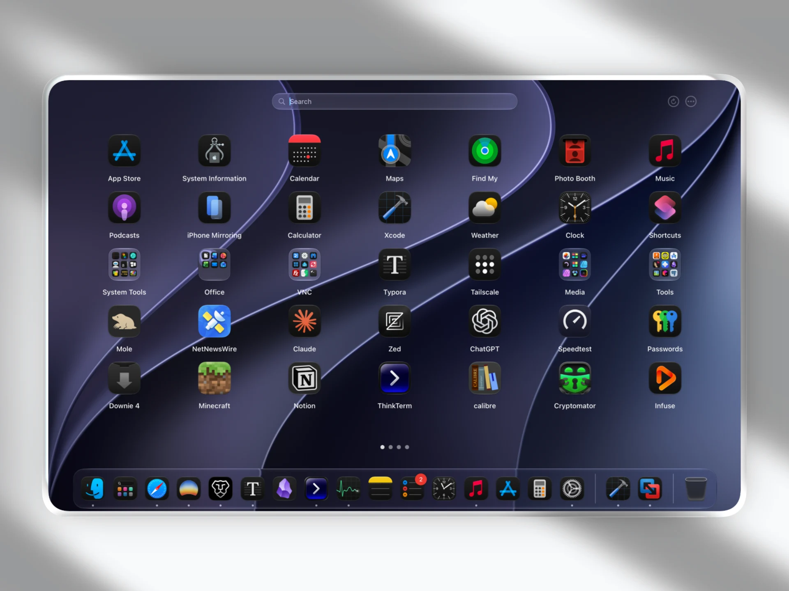
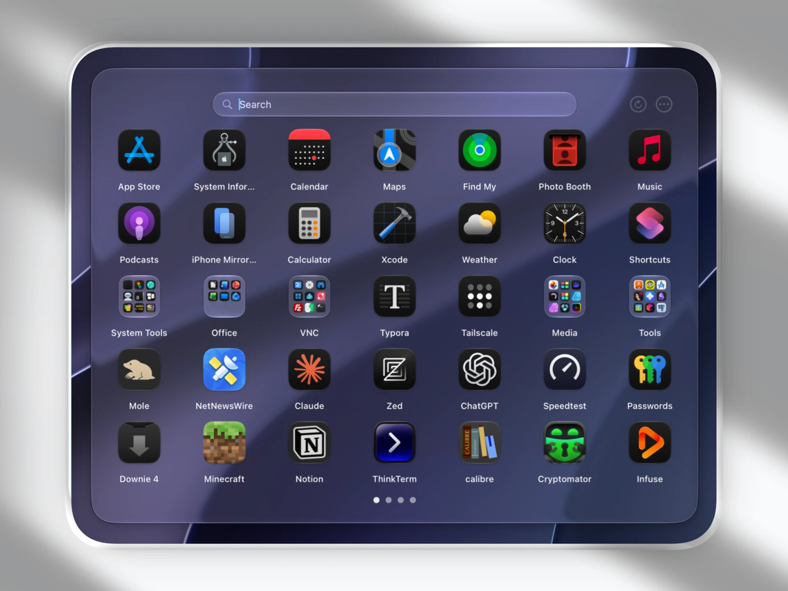
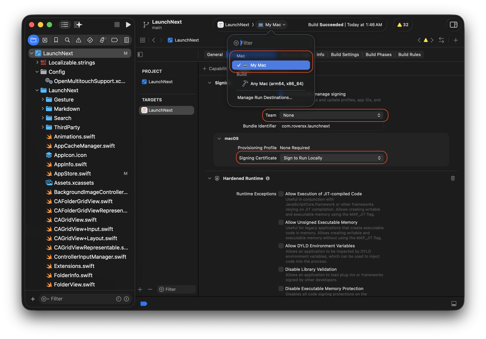
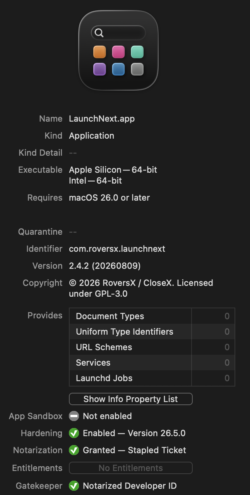

# LaunchNext

**Języki**: [English](../README.md) | [简体中文](README.zh.md) | [繁體中文](README.zh-TW.md) | [日本語](README.ja.md) | [한국어](README.ko.md) | [Français](README.fr.md) | [Español](README.es.md) | [Deutsch](README.de.md) | [Русский](README.ru.md) | [हिन्दी](README.hi.md) | [Tiếng Việt](README.vi.md) | [Italiano](README.it.md) | [Čeština](README.cs.md) | [Polski](README.pl.md)

## 📥 Pobieranie

**[Pobierz tutaj](https://github.com/RoversX/LaunchNext/releases/latest)** - pobierz najnowsze wersję

🌐 **Strona**: [closex.org/launchnext](https://closex.org/launchnext/)  
📚 **Dokumentacja**: [docs.closex.org/launchnext](https://docs.closex.org/launchnext/)

⭐ Rozważ dodanie gwiazdki [LaunchNext](https://github.com/RoversX/LaunchNext), a zwłaszcza [LaunchNow](https://github.com/ggkevinnnn/LaunchNow)!

| | |
|:---:|:---:|
|  |  |
|  |  |

macOS Tahoe usunął Launchpada, a nowy zamiennik jest bardzo niewygodny i nie wykorzystuje Twojego GPU. Apple, proszę, dajcie ludziom przynajmniej opcję powrotu do starego. Zanim to nastąpi, oto LaunchNext

*Zbudowany na bazie [LaunchNow](https://github.com/ggkevinnnn/LaunchNow) autorstwa ggkevinnnn - ogromne podziękowania dla oryginalnego projektu!❤️*

*LaunchNow wybrał licencję GPL 3. LaunchNext podlega tym samym warunkom licencyjnym.*

### Instalacja przez Homebrew 🍺

```bash
brew install --cask RoversX/homebrew-tap/launchnext
```

LaunchNext ma własny aktualizator. Cask Homebrew służy głównie do instalacji i ręcznych aktualizacji.

⚠️ **Jeśli macOS zablokuje aplikację, uruchom to polecenie w Terminalu:**
```bash
sudo xattr -r -d com.apple.quarantine /Applications/LaunchNext.app
```
**Dlaczego**: ~~Nie stać mnie na certyfikat deweloperski Apple (99 USD rocznie), więc macOS blokuje niepodpisane aplikacje.~~ To polecenie usuwa znacznik kwarantanny, aby aplikacja mogła się uruchomić. **Używaj tego polecenia tylko z aplikacjami, którym ufasz.**

### Stan podpisywania kodu

Po ogromnym wysiłku, począwszy od LaunchNext 2.4.2, wydania są podpisywane i notaryzowane przez Apple. Na razie to testuję — członkostwo trwa tylko rok, a utrzymanie go nie jest tanie, więc mogę go nie odnowić. W takim przypadku kolejne wydania wrócą do kompilacji niepodpisanych lub podpisanych ad hoc, co niekoniecznie byłoby złym pomysłem.

Budujesz ze źródeł? Zobacz [Konfiguracja lokalnego podpisywania kodu](#configure-local-code-signing).

### Co oferuje LaunchNext
- ✅ **Import jednym kliknięciem ze starego systemowego Launchpada** - bezpośrednio odczytuje natywną bazę SQLite Launchpada (`/private$(getconf DARWIN_USER_DIR)com.apple.dock.launchpad/db/db`), aby wiernie odtworzyć istniejące foldery, pozycje aplikacji i układ
- ✅ **Klasyczne wrażenia z Launchpada** - działa dokładnie jak ukochany oryginalny interfejs
- ✅ **Obsługa wielu języków** - pełna internacjonalizacja, m.in. angielski, chiński uproszczony, chiński tradycyjny, japoński, francuski, hiszpański, niemiecki, rosyjski, polski i inne
- ✅ **Ukrywanie etykiet ikon** - czysty, minimalistyczny widok, gdy nazwy aplikacji nie są potrzebne
- ✅ **Własne rozmiary ikon** - dostosuj wymiary ikon do swoich preferencji
- ✅ **Inteligentne zarządzanie folderami** - twórz i porządkuj foldery tak jak wcześniej
- ✅ **Wyszukiwanie rozmyte i nawigacja klawiaturą** - szybko znajdziesz aplikacje, nawet przy niepełnym lub niedokładnym wpisie
- ✅ **Obsługa CLI / TUI** - przeglądaj i obsługuj układ z poziomu terminala
- ✅ **Aktywny narożnik i natywne gesty** - otwieraj LaunchNext narożnikami, gestami gładzika oraz gestami 4 / 5 palców
- ✅ **Przeciąganie aplikacji bezpośrednio do Docka** - dostępne w Next Engine + Core Animation
- ✅ **Foldery Core Animation** - zawartość folderów obsługuje układ stronicowany i przewijany pionowo
- ✅ **Lepsze menu kontekstowe** - Pokaż w Finderze, Kopiuj ścieżkę aplikacji, Zmień nazwę folderu i skonfigurowane akcje deinstalacji
- ✅ **Karta aktualizacji z informacjami o wydaniu w Markdown** - bogatsze aktualizowanie w aplikacji
- ✅ **Ulepszona kopia zapasowa oraz obsługa kontrolera i głosu** - większa niezawodność i dostępność

### Co straciliśmy w macOS Tahoe
- ❌ Brak własnej organizacji aplikacji
- ❌ Brak folderów tworzonych przez użytkownika
- ❌ Brak dostosowywania przez przeciąganie
- ❌ Brak wizualnego zarządzania aplikacjami
- ❌ Wymuszone grupowanie według kategorii


### Przechowywanie danych
Dane aplikacji są bezpiecznie zapisywane w:
```
~/Library/Application Support/LaunchNext/Data.store
```

### Natywna integracja z Launchpadem
Odczytuje dane bezpośrednio z systemowej bazy Launchpada:
```bash
/private$(getconf DARWIN_USER_DIR)com.apple.dock.launchpad/db/db
```

## Instalacja

### Wymagania
- macOS 26 (Tahoe) lub nowszy
- Procesor Apple Silicon lub Intel
- Xcode 26 (do budowania ze źródeł)

### Budowanie ze źródeł

1. **Sklonuj repozytorium**
   ```bash
   git clone https://github.com/RoversX/LaunchNext.git
   cd LaunchNext
   ```

2. **Otwórz w Xcode**
   ```bash
   open LaunchNext.xcodeproj
   ```

3. <a name="configure-local-code-signing"></a>**Skonfiguruj lokalne podpisywanie kodu**
   - Do budowania i współtworzenia LaunchNext nie jest wymagane płatne członkostwo w Apple Developer.
   - Wybierz **target LaunchNext**, otwórz **Signing & Capabilities**, ustaw **Team** na `None` i wybierz `Sign to Run Locally` jako certyfikat podpisywania.
   - Pozostaw włączony Hardened Runtime.
   - Xcode może oznaczyć plik projektu jako zmodyfikowany po zmianie tych lokalnych ustawień. Nie dołączaj do pull requesta zmian dotyczących wyłącznie podpisywania.

   | **Lokalne ustawienia podpisywania w Xcode dla LaunchNext** | **Podpisane i notaryzowane wydanie LaunchNext** |
   | :---: | :---: |
   |  |  |

4. **Zbuduj i uruchom**
   - Aby uruchomić aplikację przez `⌘+R`, wybierz `My Mac` jako cel uruchomienia, a nie `Any Mac`.
   - `Any Mac (arm64, x86_64)` jest przeznaczony do ogólnych kompilacji i archiwów; nie pozwala uruchomić aplikacji do debugowania.
   - Naciśnij `⌘+B`, jeśli chcesz tylko zbudować aplikację.

### Budowanie z wiersza poleceń

**Zwykła kompilacja:**
```bash
xcodebuild -project LaunchNext.xcodeproj -scheme LaunchNext -configuration Release
```

**Kompilacja uniwersalna (Intel + Apple Silicon):**
```bash
xcodebuild -project LaunchNext.xcodeproj -scheme LaunchNext -configuration Release ARCHS="arm64 x86_64" ONLY_ACTIVE_ARCH=NO clean build
```

## Użycie

### Pierwsze kroki
1. **Pierwsze uruchomienie**: LaunchNext automatycznie skanuje wszystkie zainstalowane aplikacje
2. **Wybieranie**: kliknij, aby zaznaczyć aplikację, kliknij dwukrotnie, aby ją uruchomić
3. **Wyszukiwanie**: zacznij pisać, aby natychmiast filtrować aplikacje
4. **Porządkowanie**: przeciągaj aplikacje, aby tworzyć foldery i własne układy
5. **Automatyzacja**: włącz CLI w Ustawieniach, jeśli chcesz pracować z terminala

### Import Launchpada
1. Otwórz Ustawienia (ikona zębatki)
2. Kliknij **„Importuj Launchpad”**
3. Istniejący układ i foldery zostaną zaimportowane automatycznie


### Tryby wyświetlania
- **Kompaktowy**: pływające okno z zaokrąglonymi rogami
- **Pełny ekran**: tryb pełnoekranowy dla maksymalnej widoczności
- **Legacy Engine** oraz **Next Engine + Core Animation** są dostępne w Ustawieniach
- LaunchNext może przechowywać osobne ustawienia dla pełnego ekranu i trybu kompaktowego
- Dostępne jest opcjonalne ukrywanie paska menu na pełnym ekranie; macOS ukrywa wtedy również Dock

## Funkcje zaawansowane

### Wyszukiwanie i obsługa folderów
- **Wyszukiwanie rozmyte**: dopasowuje aplikacje na podstawie fragmentów nazw, skrótów i niedokładnego wpisu
- **Konfigurowalne opóźnienie wyszukiwania**: dostosuj czas oczekiwania wyszukiwarki w Ustawieniach
- **Tryby układu folderów**: wybierz między stronicowanymi folderami w stylu Launchpada a folderami przewijanymi pionowo
- **Renderowanie folderów Core Animation**: płynniejsza obsługa większych folderów

### Inteligentna interakcja z tłem
- Inteligentne wykrywanie kliknięć zapobiega przypadkowemu zamknięciu
- Obsługa gestów uwzględniająca kontekst
- Ochrona pola wyszukiwania

### Optymalizacja wydajności
- **Buforowanie ikon**: inteligentne buforowanie obrazów dla płynnego przewijania
- **Leniwe ładowanie**: efektywne wykorzystanie pamięci
- **Skanowanie w tle**: wykrywanie aplikacji bez blokowania interfejsu

### Automatyzacja i aktywacja
- **CLI / TUI**: zarządzaj LaunchNext z poziomu terminala
- **Aktywny narożnik**: otwieraj LaunchNext z konfigurowalnego narożnika ekranu
- **Eksperymentalne gesty natywne**: gesty ściągnięcia palców i stuknięcia 4 / 5 palcami, w tym wybór zewnętrznego gładzika
- **Przeciąganie do Docka**: przeciągaj aplikacje bezpośrednio do Docka macOS w Next Engine + Core Animation

### Zarządzanie aplikacjami
- **Akcje menu kontekstowego**: pokazywanie aplikacji w Finderze, kopiowanie ścieżek aplikacji, zmiana nazw folderów i używanie skonfigurowanego deinstalatora

### Narzędzia aktualizacji i kopii zapasowych
- **Karta aktualizacji**: sprawdzaj aktualizacje i czytaj informacje o wydaniu w Markdown w Ustawieniach
- **Narzędzia kopii zapasowych**: bezpieczniejsze tworzenie i przywracanie kopii zapasowych
- **Aktualizacje powiadomień**: obsługa nowoczesnego API powiadomień

### Obsługa wielu wyświetlaczy
- Automatyczne wykrywanie ekranów
- Pozycjonowanie dla każdego wyświetlacza osobno
- Płynna praca z wieloma monitorami

## Rozwiązywanie problemów

### Typowe problemy

**P: Aplikacja się nie uruchamia?**
O: Upewnij się, że masz macOS 26.0+ i sprawdź uprawnienia systemowe.

**P: Którego silnika powinienem używać?**
O: Dla najlepszych wrażeń zalecany jest `Next Engine + Core Animation`. `Legacy Engine` jest nadal dostępny, jeśli potrzebujesz starszej ścieżki zgodności.

**P: Dlaczego polecenie CLI jeszcze nie istnieje?**
O: Najpierw włącz interfejs wiersza poleceń w Ustawieniach. LaunchNext może za Ciebie zainstalować i usunąć zarządzane polecenie `launchnext`.

## Współtworzenie

Zapraszamy do współpracy! Prosimy o:

1. Zrobienie forka repozytorium
2. Utworzenie gałęzi funkcji (`git checkout -b feature/amazing-feature`)
3. Zatwierdzenie zmian (`git commit -m 'Add amazing feature'`)
4. Wypchnięcie gałęzi (`git push origin feature/amazing-feature`)
5. Otwarcie Pull Requesta

### Wytyczne dla programistów
- Stosuj konwencje stylu Swift
- Dodawaj sensowne komentarze do złożonej logiki
- Testuj na wielu wersjach macOS
- Zachowuj kompatybilność wsteczną

### Dokumentacja

- [Folder Liquid Glass](../Documentation/FolderLiquidGlass.md) — ograniczenia projektowe
  stojące za szklanymi ikonami folderów w siatce Core Animation, co zostało
  zweryfikowane i co nadal wymaga akceptacji w głównej aplikacji.
- [Diagnostyka siatki](../scripts/diagnostics/README.md) — ręczne sondy dla siatki
  i nakładki szkła, wraz z poleceniami i ograniczeniami pokrycia.

Testy jednostkowe znajdują się w `LaunchNextTests` i uruchamia się je poleceniem:

```sh
xcodebuild test -scheme LaunchNext -destination 'platform=macOS'
```

## Przyszłość zarządzania aplikacjami

Gdy Apple odchodzi od konfigurowalnych interfejsów, LaunchNext jest krokiem w stronę kontroli i personalizacji po stronie użytkownika. Nadal mam nadzieję, że Apple przywróci Launchpada.

**LaunchNext** to nie tylko zamiennik Launchpada — to deklaracja, że wybór użytkownika ma znaczenie.


---

**LaunchNext** - odzyskaj swój launcher aplikacji 🚀

*Stworzony dla użytkowników macOS, którzy nie godzą się na kompromisy w personalizacji.*

## Narzędzia deweloperskie

- Claude Code 
- Cursor 
- OpenAI Codex CLI
- Perplexity
- Google


- Obsługa eksperymentalnych gestów opiera się na [OpenMultitouchSupport](https://github.com/Kyome22/OpenMultitouchSupport) oraz forku autorstwa [KrishKrosh](https://github.com/KrishKrosh/OpenMultitouchSupport).❤️


